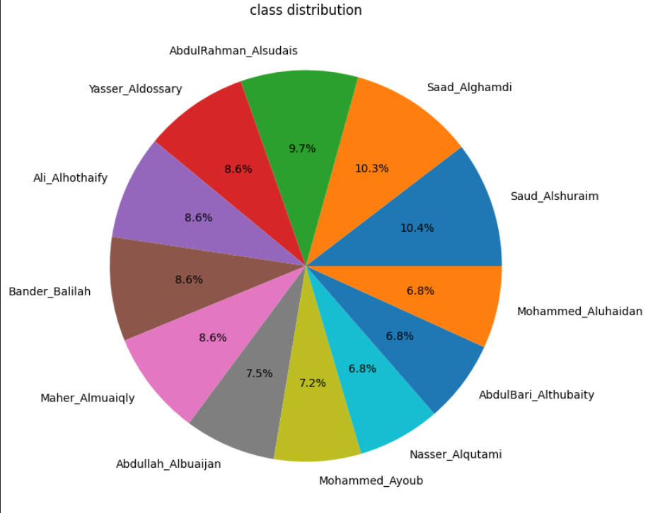
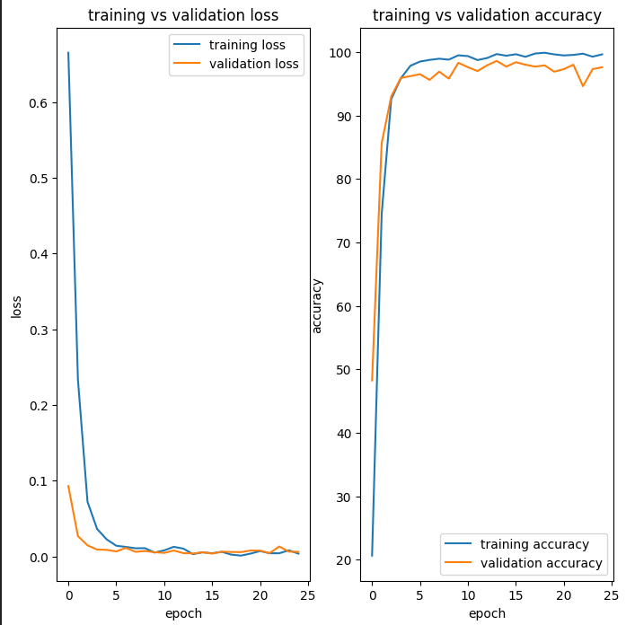

# Quran Reciter Classification from Mel Spectrograms

A convolutional neural network that classifies audio recitations of the Quran by reciter identity, using mel spectrogram representations of raw audio as input. The model distinguishes between 12 well-known reciters.

## Motivation

Speaker identification from audio is a well-studied problem in signal processing, and Quran recitation audio provides a domain with distinctive acoustic and prosodic characteristics per reciter (pacing, tajweed style, pitch range). This project treats the task as an image classification problem by converting audio into mel spectrograms, then applying a custom CNN — a standard and effective approach for audio classification tasks.

## Dataset

- **Source:** (https://www.kaggle.com/datasets/mohammedalrajeh/quran-recitations-for-audio-classification)
- **Size:** 6,687 audio clips
- **Classes:** 12 reciters
- **Split:** 70% train / 15% validation / 15% test

### Class Distribution

The dataset is moderately imbalanced across reciters, with class shares ranging from ~6.8% to ~10.4%.



## Preprocessing

Each audio clip is converted to a mel spectrogram before being passed to the network:

- Sample rate: 22,050 Hz
- Clip duration: 5 seconds
- Mel spectrogram: `n_fft=2048`, `hop_length=512`, `n_mels=128`
- Converted to decibel scale (`librosa.power_to_db`)
- Length-normalized to a fixed number of frames (`librosa.util.fix_length`)
- Resized to 128×256 to give a consistent input shape

Each resulting spectrogram is treated as a single-channel (grayscale) image of shape `(1, 128, 256)`.

## Model Architecture

A custom CNN built in PyTorch, consisting of 3 convolutional blocks followed by 3 fully connected layers:

| Layer | Details |
|---|---|
| Conv1 | 1 → 16 channels, 3×3 kernel, padding 1 |
| MaxPool | 2×2 |
| Conv2 | 16 → 32 channels, 3×3 kernel, padding 1 |
| MaxPool | 2×2 |
| Conv3 | 32 → 64 channels, 3×3 kernel, padding 1 |
| MaxPool | 2×2 |
| Flatten | 64 × 16 × 32 = 32,768 features |
| FC1 | 32,768 → 4096, ReLU, Dropout(0.5) |
| FC2 | 4096 → 1024, ReLU, Dropout(0.5) |
| FC3 | 1024 → 512, ReLU, Dropout(0.5) |
| Output | 512 → 12 |

Each conv block applies MaxPool and ReLU after the convolution. Dropout (p=0.5) is applied after each fully connected layer to reduce overfitting.

**Training configuration:**
- Loss: CrossEntropyLoss
- Optimizer: Adam
- Epochs: 25
- Hardware: NVIDIA T4 GPU (Kaggle)

## Results

Trained for 25 epochs in 436.5 seconds (~7.3 minutes) on a T4 GPU.

| Metric | Train | Validation | Test |
|---|---|---|---|
| Accuracy | 99.68% | 98.10% | **97.31%** |
| Loss | 0.0039 | 0.0029 | 0.0056 |



Training and validation accuracy converge quickly, reaching above 95% by epoch 3 and stabilizing above 97% for the remainder of training. Validation loss tracks training loss closely with no strong signs of overfitting across epochs, aside from minor fluctuation typical of a relatively small validation set.


## Repository Structure

```
.
├── README.md
├── quran_reciter_classification.ipynb   # full training notebook
├── readme_assets/
│   ├── class_distribution.png
│   └── training_curves.png
```

Note: the audio dataset itself is not included in this repository due to size. It is available at the Kaggle link above.

## Future Work

- Root-cause the high test loss despite high test accuracy (see note above)
- Address class imbalance via stratified sampling or class-weighted loss
- Experiment with a pretrained audio/image backbone (e.g. ResNet on spectrograms) as a comparison baseline against the custom CNN
- Add a confusion matrix to identify which reciters are most frequently confused with one another
